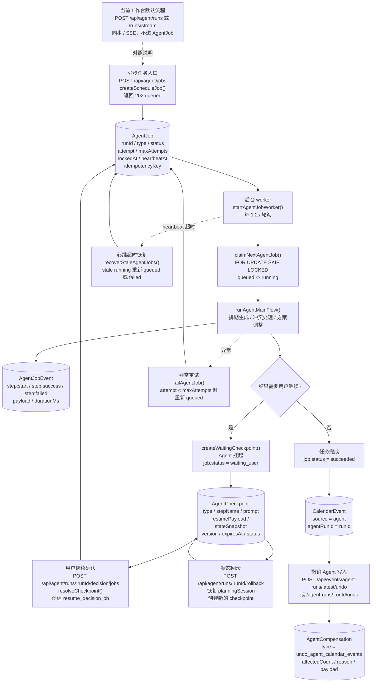

# Agent Async Recovery Flow



## 验收参照物

- `AgentJob.status` 应该能从 `queued` 变为 `running`，最终变为 `waiting_user`、`succeeded`、`failed` 或 `canceled`。
- `AgentCheckpoint.status` 在等待用户确认时是 `pending`，用户继续时会被 `resolveCheckpoint()` 标成 `resolved`。
- `AgentJobEvent` 应该记录每个后台步骤，比如 `job:running`、`step:start`、`step:success`、`job:waiting_user`。
- `CalendarEvent.source = agent` 且 `agentRunId` 有值时，说明日程来自 Agent 写入。
- 撤销后 `CalendarEvent.deletedAt` 会被填上，`AgentCompensation` 会新增一条补偿记录。
```
