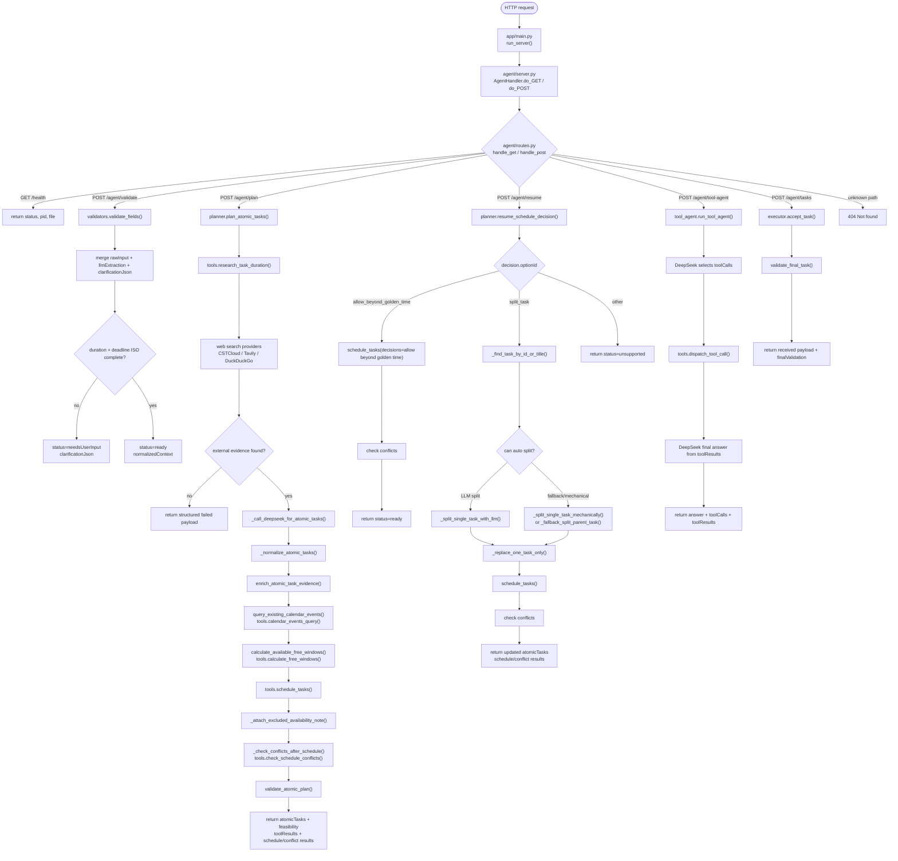

# Python Agent Flow

```mermaid
flowchart TD
    start([HTTP request]) --> server["app/main.py<br/>run_server()"]
    server --> handler["agent/server.py<br/>AgentHandler.do_GET / do_POST"]
    handler --> routes{"agent/routes.py<br/>handle_get / handle_post"}

    routes -->|GET /health| health["return status, pid, file"]

    routes -->|POST /agent/validate| validate["validators.validate_fields()"]
    validate --> validateInput["merge rawInput + llmExtraction + clarificationJson"]
    validateInput --> validateDecision{"duration + deadline ISO complete?"}
    validateDecision -->|no| needsInput["status=needsUserInput<br/>clarificationJson"]
    validateDecision -->|yes| validateReady["status=ready<br/>normalizedContext"]

    routes -->|POST /agent/plan| plan["planner.plan_atomic_tasks()"]
    plan --> research["tools.research_task_duration()"]
    research --> searchProviders["web search providers<br/>CSTCloud / Tavily / DuckDuckGo"]
    searchProviders --> evidenceDecision{"external evidence found?"}
    evidenceDecision -->|no| planFailed["return structured failed payload"]
    evidenceDecision -->|yes| deepseekPlan["_call_deepseek_for_atomic_tasks()"]
    deepseekPlan --> normalizeTasks["_normalize_atomic_tasks()"]
    normalizeTasks --> enrichEvidence["enrich_atomic_task_evidence()"]
    enrichEvidence --> calendarQuery["query_existing_calendar_events()<br/>tools.calendar_events_query()"]
    calendarQuery --> freeWindows["calculate_available_free_windows()<br/>tools.calculate_free_windows()"]
    freeWindows --> schedule["tools.schedule_tasks()"]
    schedule --> attachNote["_attach_excluded_availability_note()"]
    attachNote --> conflictCheck["_check_conflicts_after_schedule()<br/>tools.check_schedule_conflicts()"]
    conflictCheck --> feasibility["validate_atomic_plan()"]
    feasibility --> planResponse["return atomicTasks + feasibility<br/>toolResults + schedule/conflict results"]

    routes -->|POST /agent/resume| resume["planner.resume_schedule_decision()"]
    resume --> resumeDecision{"decision.optionId"}
    resumeDecision -->|allow_beyond_golden_time| allowSchedule["schedule_tasks(decisions=allow beyond golden time)"]
    allowSchedule --> allowConflict["check conflicts"]
    allowConflict --> resumeReady["return status=ready"]
    resumeDecision -->|split_task| findParent["_find_task_by_id_or_title()"]
    findParent --> splitMode{"can auto split?"}
    splitMode -->|LLM split| llmSplit["_split_single_task_with_llm()"]
    splitMode -->|fallback/mechanical| mechanicalSplit["_split_single_task_mechanically()<br/>or _fallback_split_parent_task()"]
    llmSplit --> replaceTask["_replace_one_task_only()"]
    mechanicalSplit --> replaceTask
    replaceTask --> reschedule["schedule_tasks()"]
    reschedule --> resumeConflict["check conflicts"]
    resumeConflict --> splitResponse["return updated atomicTasks<br/>schedule/conflict results"]
    resumeDecision -->|other| unsupported["return status=unsupported"]

    routes -->|POST /agent/tool-agent| toolAgent["tool_agent.run_tool_agent()"]
    toolAgent --> selectTools["DeepSeek selects toolCalls"]
    selectTools --> dispatch["tools.dispatch_tool_call()"]
    dispatch --> finalAnswer["DeepSeek final answer from toolResults"]
    finalAnswer --> toolResponse["return answer + toolCalls + toolResults"]

    routes -->|POST /agent/tasks| tasks["executor.accept_task()"]
    tasks --> finalValidate["validate_final_task()"]
    finalValidate --> taskResponse["return received payload + finalValidation"]

    routes -->|unknown path| notFound["404 Not found"]
```
